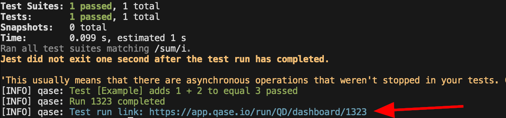
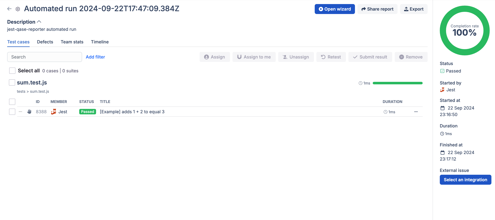

# Jest

Jest is a powerful JavaScript testing framework developed by Meta, known for its ease of use and zero-config setup. It works well with any JavaScript project, especially React, and includes features like built-in assertions, snapshot testing, and mocking.

Jest runs tests in parallel for faster execution and automatically generates code coverage reports.

With the `jest-qase-reporter` you can publish the results of your automated test runs to your Qase project using the public API.

## Installation

To integrate Qase into your project, follow these steps -

### Activate the Jest App

To activate the app, go to the [Apps](https://app.qase.io/apps?app=jest-reporter) section in your workspace, and click on 'Activate'

Switch to the 'Access tokens' tab, and create a new API token from here. Save the API token as we'll need it for the next steps.

### Add `jest-qase-reporter` to your project

To install and add the reporter as a development dependency, run the following in node project -

```
npm install -D jest-qase-reporter
```

### Add the reporter to your Jest configuration file

At the very least, the reporter will need two variables defined - your Jest App's Token, and the Qase Project you want to publish the results to -

// `jest.config.js`

```javascript
export default {
  reporters: [
    'default',
    [
      'jest-qase-reporter',
      {
        testops: {
          api: {
            token: 'api_key', // Replace with your actual API token
          },
          project: 'project_code', // Replace with your project code
          run: {
            complete: true,
          },
        },
        debug: true,
      },
    ],
  ],
  // Other configurations...
};
```

*The above example is using *`ES Module` format, for a `CommonJS` version, copy the code from this toggle.

```
const defaultConfig = {
  reporters: [
    'default',
    [
      'jest-qase-reporter',
      {
        testops: {
          api: {
            token: 'api_key', // Replace with your actual API token
          },
          project: 'project_code', // Replace with your project code
          run: {
            complete: true,
          },
        },
        debug: true,
      },
    ],
  ],
  // Other configurations...
};

module.exports = defaultConfig;
```

Please refer to this article for guidance on how to find your Project code in Qase.

If you do not want to configure the reporter's options in your Jest configuration file, you have the option to use a `qase.config.json` to have all your reporter options defined.

Create a new `qase.config.json` file at the root of your repository, and add the project code and App token.

```json
{
  "testops": {
    "api": {
      "token": "<token>"
    },
    "project": "<project_code>"
  }
}
```

## Let's verify the integration

We'll use a simple test to check if the results are being published to your Qase project.

Add the following `sum` function to the `src/`

// `sum.js`

```javascript
function sum(a, b) {
  return a + b;
}

module.exports = sum;
```

Now, add the following test in the `tests/` directory

```javascript
const sum = require('../src/sum');

test('[Example] adds 1 + 2 to equal 3', () => {
  expect(sum(1, 2)).toBe(3);
});
```

**Now, let's run the** **test**, by executing the following command -

```
QASE_MODE=testops npx jest sum
```

In the above command, we're setting the reporter's mode to '`testops`' using the Environment variable `QASE_MODE`.


Click on the link printed at the end of the run to go to the test run in Qase.


<div style="text-align: center;">
    
</div>




## Configuration

The `jest-qase-reporter` can operate in two modes:
* Testops: publishes the report to the specified Qase Project.
* Report: generates a JSON report locally in the specified directory.

In the next section, we'll look at all the available configuration options.
